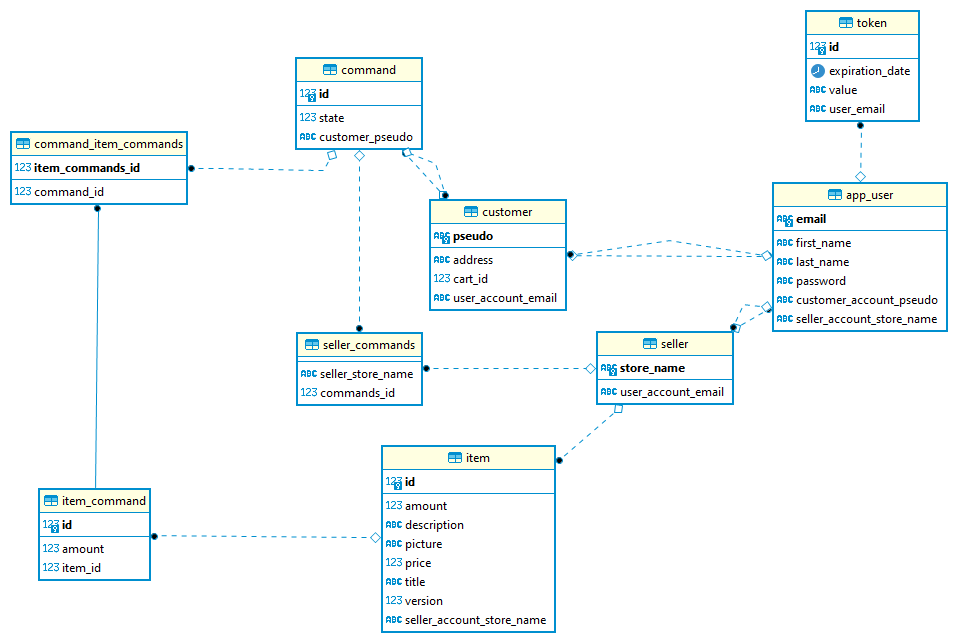

<div align="center" style="margin-bottom:50px">

[](https://github.com/M2DL-IVVQ-DevOps/ivvq-projet-2021-money-et-dystopie)

# **Money et Dystopie**

**L'argent n'apporte pas forcément le bonheur. Mais des fois oui quand même.**

</div>

# Description du projet

Le projet consiste en un site marchant sur lequel il est possible d'acheter de l'argent.

# Décomposition du projet

* Un Front-End Vue.js
* Un Back-End Spring Boot

# Contributeurs

[Alessandra FRANZESE](https://github.com/NinaNekonoran)
[Aymeric PINEL](https://github.com/amplul)
[Nicolas ANDRÉ](https://github.com/iomega11)
[Romain GOYHENEIX](https://github.com/vandorz)

# Développement front-end
La partie front-end est développée à l'aide de l'IDE **WebStorm** de JetBrains.

A des fins de qualité, le projet embarque entre autres [**ESLint**](https://eslint.org/). Il permet d'analyser le code et d'identifier les problèmes associés.
Il est possible de l'appeler au travers du terminal.
Pour cela, il faut d'abord se positionner à la racine du projet front, puis taper la commande suivante :
```console
npm run eslint
```

# Développement back-end
La partie back-end est développée à l'aide de l'IDE **IntelliJ** de JetBrains.

Le projet est accompagné du plugin [**Spotless**](https://github.com/diffplug/spotless), permettant d'appliquer de nombreuses règles de formatage au code.
Pour l'exécuter, il faut d'abord se positionner à la racine du projet back, puis taper la commande suivante :
```console
mvn spotless:apply
```

Le plugin [**Spotbugs**](https://spotbugs.github.io/) est également présent.
Celui-ci permet d'analyser statiquement le code en vue d'identifier les potentiels bugs ou risques de sécurité.
Pour le lancer, il faut d'abord se positionner à la racine du projet back, puis la commande :
```console
mvn clean install spotbugs:check
```
Spotbugs affichera sur le terminal le résultat de l'analyse.
**A noter que le build maven échoue si une erreur est détectée. Cela ne veut pas dire que l'analyse a échoué.**

Il est également possible de visualiser la couverture par les tests du code du back-end à l'aide de [**JaCoCo**](https://www.eclemma.org/jacoco/).
JaCoCo est couplé à Sonar. La couverture de code sera donc visible sur l'interface Sonar.
Pour visualiser la couverture de code, il faut d'abord se positionner à la racine du projet back, puis taper la commande suivante :
```console
mvn clean install sonar:sonar
```
Le résultat est publié sur le serveur hébergeant Sonar. Il est visible à travers son interface.

# Lancement du projet

Le projet est conteneurisé avec Docker, et peut-être lancé à l'aide de Docker-compose.

Pour compiler le projet :
```console
docker-compose build
```

Pour lancer le serveur :

```console
docker-compose up
```

Le serveur est alors accessible ici :
```console
http://localhost:43000/index.html
```

# La base de données

Le projet utilise une base de données pour stocker les éléments tels que les comptes utilisateurs,
les articles en vente ou encore les commandes passées. Le schéma de la base de données est visible ci-dessous.


## Les différentes bases de données utilisées

Le projet dispose de deux profils d'exécution : **dev** et **prod**, définis par la variable d'environnement **profile**.
* Le mode **dev** permet d'utiliser une base de données **H2**, stockant les éléments en mémoire, et réinitialisée à chaque lancement.
Utile pour développer le back-end sans passer par la conteneurisation.
* Le mode **prod** permet d'utiliser une base de données **PostgreSQL**.
C'est ce mode qui est utilisé lorsqu'on conteneurise le projet ou si l'on souhaite développer en local à l'aide du docker-compose.

La base de données PostgreSQL utilisée dans le conteneur local (pour le développement) et dans le conteneur distant (en production) ne sont pas les mêmes :
* Celle utilisée en local est réinitialisée à chaque lancement. Elle fonctionne à l'aide d'un conteneur Docker dédié.
* Celle utilisée en production est hébergée à travers la plateforme Heroku et n'est que rarement réinitialisée.

## Comment accéder aux bases de données

En profil d'exécution **dev** il est possible d'accéder à l'interface H2 à travers ce lien : http://localhost:8080/h2-console

En profil d'exécution **prod** aucune interface n'est disponible pour visualiser les données.
Il est indispensable d'utiliser un logiciel dédié, tel que [DBeaver](https://dbeaver.io/) :

1. Installer DBeaver à partir de ce lien
2. Lancer l'application
3. **Démarrer une nouvelle connexion** de type **postgreSQL** en renseignant
**l'hôte**, **l'URL de la base de données**, **le nom d'utilisateur** et **le mot de passe**.
Ces informations sont accessibles dans le fichier **db.env** lors d'un développement local, et dans l'interface Heroku postgres en production.
